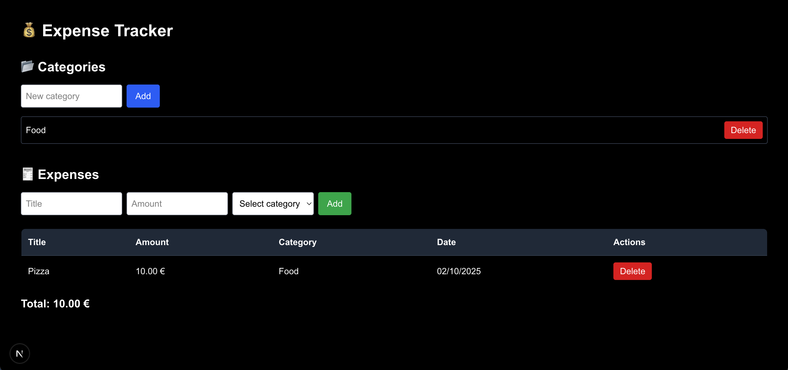

# 💰 Expense Tracker  
A full-stack expense tracking app built as part of a practicum project.  
It uses **NestJS + Prisma + PostgreSQL** for the backend and **Next.js + Tailwind CSS** for the frontend.  
The database runs inside a **Docker** container.

---

## 🚀 Tech Stack  
**Backend:** Node.js, NestJS, Prisma, PostgreSQL, Docker  
**Frontend:** Next.js, TailwindCSS  

---

## 📂 Project Structure
```bash  
expense-tracker/
├── api/ # NestJS backend (Prisma + CRUD endpoints for expenses & categories)
├── web/ # Next.js frontend (UI + Tailwind)
├── infra/ # Docker Compose setup for PostgreSQL
├── docs/ # Screenshots & documentation assets
│ ├── screenshot-dark.png
│ └── screenshot-light.png
└── README.md # Project documentation
```

---

## 📸 Screenshots



---

## ⚙️ Setup Instructions  

Clone the repo and run the following commands:

```bash
# clone repo
git clone https://github.com/Fivkas/expense-tracker.git
cd expense-tracker

# start database
cd infra
docker compose up -d

# backend (NestJS)
cd ../api
npm install
npm run start:dev

# frontend (Next.js)
cd ../web
npm install
npm run dev
```

## 👨‍💻 Author

Fivos Kapsalis
🔗 GitHub: [Fivkas](https://github.com/Fivkas)